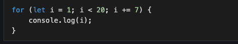

# ASSIGNMENT WEEK 2

## 1. List the symbols for each of the below Javascript operators

* Arithmetic Operators 
    * + , -, *, \
* Assignment Operators
    * = , -= , += , /=  , *=
* Comparison Operators
    * ===, ==, >= , <= ,!= ,!==
* Logical Operators
    * && , || , !
* Bitwise Operator
    * ~ , & ,^ , >> , << , >>

## 2. For each JavaScript Operator, write 2 examples.
    
* Arithmetic Operators examples:
    * console.log(12+3) //15  console.log(4*3) //12
* Assignment Operators examples: 
    * let my_num=12   my_num += 15 //12+15=27
- Comparison Operators examples:  
    - 4 > 4 // false  5 < 6 //true 
- Logical Operators:
    - console.log(Undefined && false) // false
    - console.log(0 && true) //false
    - console.log('hello' && 1) //true    
- Bitwise Operator:
    - 0 & 1 // 0
    - 0 | 1 // 1    
    - 0 ^ 1 // 1

## 3. USING IF-ELSE STATEMENT
Bolatito just got admitted to Greenfield High School as an Arts student. To commence her studies, she needs to know the subjects she will be taking as an Arts student. All students have to take the General subjects.

Using if…else conditional statement, write a program that will help Bolatito determine the subjects she will be taking for the session using her class group. Also, in the case of an invalid class group, your output should be the General subjects. 

- CHECK THE SCRIPT.JS FILE FOR THE CODE SOLUTION

## 4. What is the result when the following program is executed?

- // 1 , 7 , 15